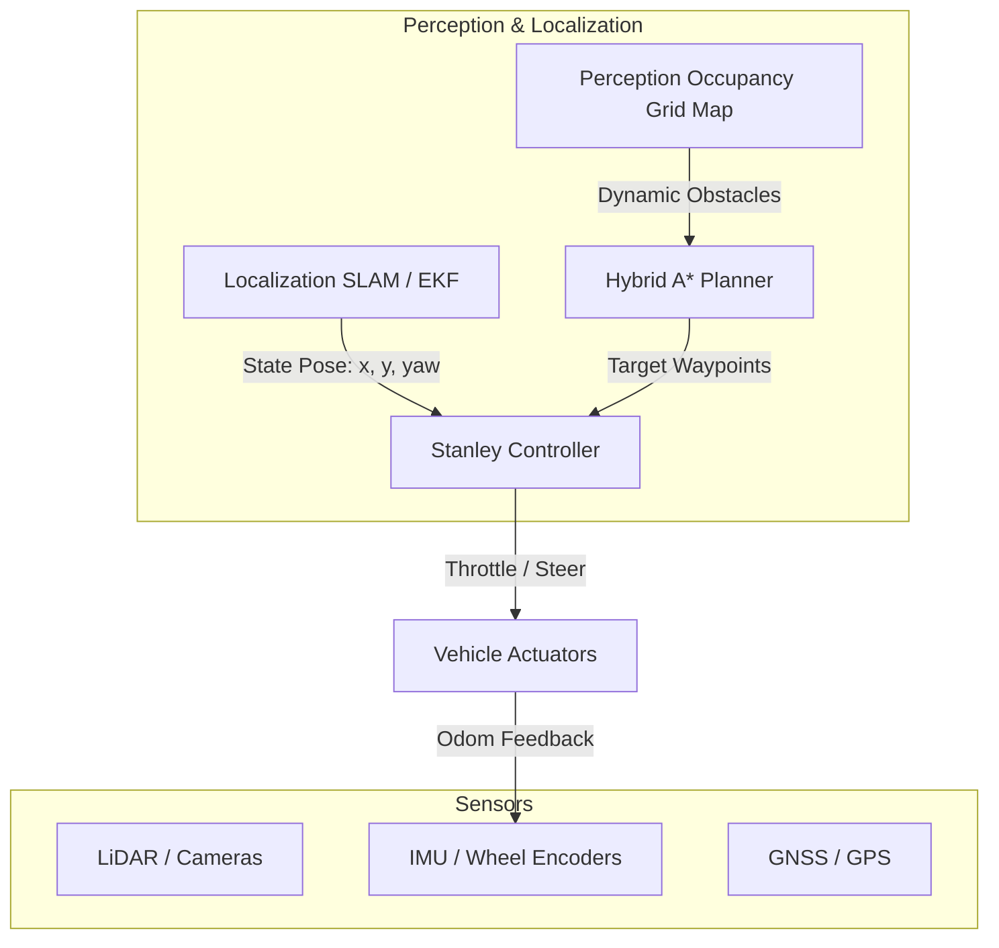

# Autonomous Garage Parking Proof of Concept (PoC)

An interactive simulation of an autonomous vehicle parking into a tight garage channel from variable starting positions. The project uses a **Hybrid A\*** path planner to find kinematically feasible trajectories (with forward and reversing gear shifts) and a **Stanley Lateral Controller** to execute the plan under a **Kinematic Bicycle Model**.

---

## 🚘 Project Overview

This repository provides a proof-of-concept implementation of a automated valet parking system for a garage layout. 

### Key Features
- **Hybrid A\* Planner (`hybrid_a_star.py`)**: Computes a continuous path checking for collisions and vehicle kinematics. It dynamically assigns gear changes (forward/reverse commands) to maneuver through narrow passages.
- **Stanley Controller (`stanley_controller.py`)**: A path-tracking lateral controller that handles both forward steering and reversed steering commands seamlessly, adjusting the heading error reference.
- **Kinematic Bicycle Model (`kinematics.py`)**: Models the non-holonomic motion constraints of the vehicle (wheelbase, width, maximum steering angle).
- **Interactive GUI (`main.py`)**: A `matplotlib`-based UI that lets you adjust the vehicle's starting position ($X$, $Y$) and orientation ($\theta$) using sliders and watch the real-time control simulation execute.

---

## 📐 Environment & Coordinate Layout

The environment dimensions are $24\,\text{m} \times 20\,\text{m}$ (origin bottom-left):
* **Road (y = 0 to 7.0 m)**: A 7 m wide east-west street with obstacles (parked cars) on the shoulders.
* **Driveway (y = 7.0 to 13.0 m)**: A 6 m long corridor leading to the garage entrance.
* **Garage Interior (y = 13.0 to 19.5 m)**: A tight 6.5 m deep, 3.7 m wide interior containing static obstacles (a shelf on the left, a trash bin on the right).
* **Traversable entrance**: Curb structures block grass areas at $y=7.0\,\text{m}$, creating a $4.3\,\text{m}$ driveway opening ($x = 9.35\,\text{m}$ to $13.65\,\text{m}$).

```
                  Back Wall (y = 19.5)
         +------------------------------------+
         |       |   [Shelf]         |        |
         |       |                   |        |
         | Grass |   GARAGE          | Grass  |
         |       |         [Bin]     |        |
         |       +===|   |===========+        |
         |       |   |   |           |        |
         |       |   Driveway        |        |
  y=7.0  +-------+===+   +===========+--------+ <-- Road Curb Line
         |                                    |
         |              ROAD                  |
         | - - - - - - - - - - - - - - - - -  | <-- Center line (y=3.5)
         |                                    |
  y=0.0  +------------------------------------+
         x=0                                  x=24.0
```

---

## 🛠️ Installation & Setup

Ensure you have Python 3.10+ installed.

### 1. Clone the Repository
```bash
git clone https://github.com/your-username/parking_env.git
cd parking_env
```

### 2. Create and Activate Virtual Environment
```bash
python3 -m venv .venv
source .venv/bin/activate  # On Windows: .venv\Scripts\activate
```

### 3. Install Dependencies
```bash
pip install -r requirements.txt
```
*(If `requirements.txt` does not exist, install the required packages: `pip install numpy matplotlib pillow`)*

---

## 🚀 Running the Simulation

Execute the main script to launch the interactive matplotlib dashboard:
```bash
python main.py
```

### How to Use the Dashboard:
1. **Configure Start Pose**: Use the **Start X**, **Start Y**, and **Heading** sliders at the bottom to reposition the vehicle on the road.
2. **Plan & Drive**: Click the **Plan & Drive** button. The Hybrid A* path planner will find a collision-free path (displayed as waypoints), and the vehicle will automatically track the path to the garage.
3. **Reset**: Click the **Reset** button to restore the vehicle to its custom start pose.

---

## ⚙️ Key Technical Choices

### 1. Hybrid A* Path Planner
- **State Representation**: Continuous state $(x, y, \theta)$ with discretized grid keys $([x/\text{res}], [y/\text{res}], [\theta/\text{yaw\_res}])$ to prune visited states.
- **Pruning Resolutions**: $XY\_RESO = 1.0\,\text{m}$, $YAW\_RESO = 15.0^\circ$ for rapid execution on real-time startup.
- **Steer Choices**: $[-35^\circ, 0^\circ, 35^\circ]$.
- **Gear Shifts**: Allowed direction changes between forward ($+1$) and reverse ($-1$) with penalized gear transition costs ($+2.0$) to avoid excessive oscillating maneuvers.

### 2. Stanley Controller
- **Front/Rear Axle Referencing**: 
  - When moving **forward**, steering feedback is calculated relative to the **front axle** center.
  - When **reversing**, control references switch to the **rear axle** center to prevent lateral instability.
- **Heading Error Adjustments**: Reversing inverts the steering response direction, so the control equation adjusts by negating the heading error term:
  $$\delta = \text{clip}\left(-\psi_{\text{error}} + \tan^{-1}\left(\frac{k \cdot e_{\text{cte}}}{v_{\text{safe}}}\right), -\delta_{\text{max}}, \delta_{\text{max}}\right)$$

---

## 🔮 Future Integration: Perception & Localization

To migrate this Proof of Concept (PoC) onto a physical vehicle or a high-fidelity simulator (such as CARLA or ROS2), the pipeline will be enhanced with localization and perception loops:



1. **Perception**:
   - Replace the static Python boundary boxes (`OBSTACLES`) with a live-updated **Costmap / Occupancy Grid Map** computed from raw 3D LiDAR point clouds and camera projections (using deep-learning based object detection like YOLO3D or BEVFormer).
   - Real-time safety margins can dynamically adjust based on obstacle uncertainty.

2. **Localization**:
   - Instead of reading the perfect vehicle states directly from python classes, feedback will be estimated using an **Extended Kalman Filter (EKF)** or a particle-filter based **SLAM algorithm** (e.g., Cartographer, AMCL).
   - Sensory inputs will fuse IMU data, Wheel Odometry, and GNSS/RTK systems.
